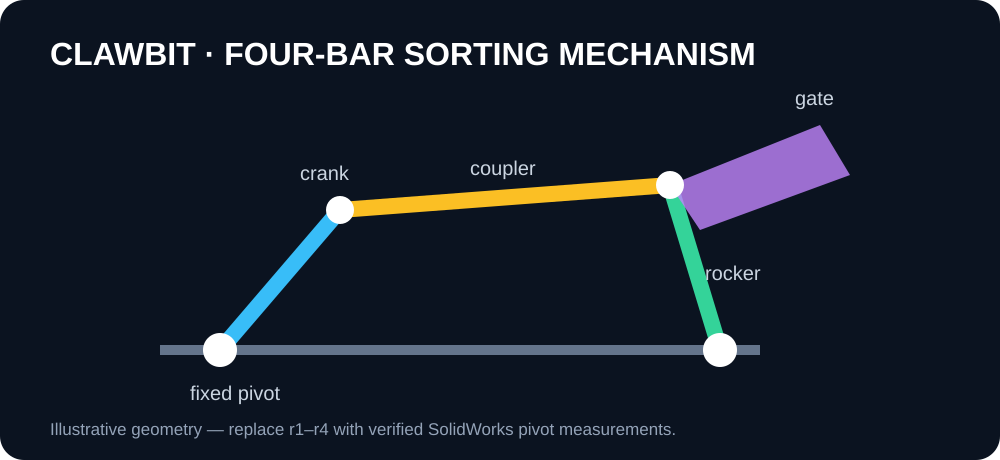

# Clawbit

[](https://github.com/impateltirth/clawbit/actions/workflows/test.yml)



Four-bar linkage ball sorting mechanism: designed and built in SolidWorks to differentiate balls by material, prototyped with 3D printing, with high-precision tolerance-specific components CNC laser cut across 15+ unique parts.

**Stack:** SolidWorks · MATLAB · CNC laser cutting · 3D printing

## What's here

| Path | Contents |
|---|---|
| `analysis/four_bar_kinematics.m` | Four-bar kinematics: Grashof classification, Freudenstein position solve, rocker swing, transmission angle, coupler curve (MATLAB or Octave) |
| `analysis/four_bar_animate.py` | Animated linkage + coupler curve trace (matplotlib) |
| `docs/mechanism.md` | Mechanism notes, link table, design checks |
| `docs/kinematic-schematic.md` | Four-bar topology and verification boundary |
| `manufacturing/BOM.csv` | Part list template — fill in from SolidWorks |
| `manufacturing/tolerances.md` | Tolerance strategy for laser-cut + printed assembly |
| `cad/` | Export drop-point for STEP/STL/DXF/PDF |

## Kinematics

The crank is motor-driven through full revolutions; the rocker oscillates and drives the sorting gate. The MATLAB script verifies the design intent:

```matlab
cd analysis
four_bar_kinematics   % Grashof check, motion plots, transmission angle
```

```bash
python3 analysis/four_bar_animate.py            # live animation
python3 analysis/four_bar_animate.py --save linkage.gif
python3 analysis/four_bar_animate.py --r1 120 --r2 35 --r3 110 --r4 90
```

**Before trusting the defaults:** the link lengths in both scripts are placeholders. Measure r1–r4 (pivot to pivot) from your SolidWorks model, update the scripts, and re-run — the Grashof type and transmission-angle check are only meaningful with your real geometry.

## Status

- [x] Four-bar kinematic analysis (MATLAB/Octave) + animation
- [x] Grashof classification and transmission-angle checks
- [x] BOM template and tolerance strategy
- [ ] Real link lengths from the SolidWorks model
- [ ] CAD exports (STEP/STL/DXF/PDF) in `cad/`
- [x] Sorting sequence and sensing/gate interface documented
- [ ] Prototype photos

## License

MIT — see [LICENSE](LICENSE).
